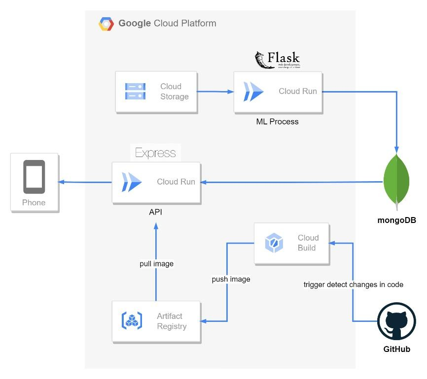

# Capstone Project Netweezen – Back-End & Cloud Computing

This repository contains the **Back-End** and **Cloud Computing** implementation for the **C23-PR550 Capstone Project**, designed using a cloud-based architecture for data processing, Machine Learning integration, and REST API services for client applications.

The system adopts a **microservices architecture** by separating **Machine Learning Processing** and **Web API Services** in a cloud environment.

## 🎯 Project Overview

This project was developed to:

- Manage Twitter data through REST APIs
- Execute **Machine Learning** processes independently
- Store and manage data using a non-relational database
- Implement automated cloud deployment using **CI/CD**

## 🛠️ Tech Stack

### Back-End
- **Express.js** — Node.js REST API framework
- **Flask** — Python API framework for triggering Machine Learning processes

### Cloud & Infrastructure
- **Google Cloud Run** — Deployment for API and ML services
- **MongoDB** — Non-relational database
- **Google Cloud Storage** — File storage service
- **Cloud Build** — CI/CD deployment pipeline
- **Artifact Registry** — Container image storage
- **GitHub** — Source control and deployment trigger

## ☁️ Cloud Architecture

<p align="center">
  
</p>

### System Architecture

The system uses **two Cloud Run services**:

### 1. ML Process Service
A **Flask-based API service** responsible for:

- Reading files from **Cloud Storage**
- Running **Machine Learning** processes
- Storing processed data into **MongoDB**

### 2. Web API Service
An **Express.js-based API service** responsible for:

- Retrieving data from **MongoDB**
- Delivering data to mobile/client applications via REST API

## 🔄 Deployment Workflow

Deployment is automated using **Cloud Build** with the following workflow:

1. Code changes in **GitHub** trigger a build process
2. **Cloud Build** builds the container image
3. The image is pushed to **Artifact Registry**
4. **Cloud Run** automatically deploys the latest version

## 🔌 API Endpoints

The API provides several main endpoints:

- **Get Tweets**
- **Get Tweets by Topic**
- **Get Tweet Item by Topic & ID**

These endpoints are used to retrieve tweet data based on topics or specific items.

## 📌 System Flow

```text
Cloud Storage → ML Process (Flask) → MongoDB
MongoDB → API Service (Express.js) → Mobile App
GitHub → Cloud Build → Artifact Registry → Cloud Run
```

## 👨‍💻 Author

**Muhammad Aminuddin**

## 📜 License

This repository is intended for educational and project development purposes.
